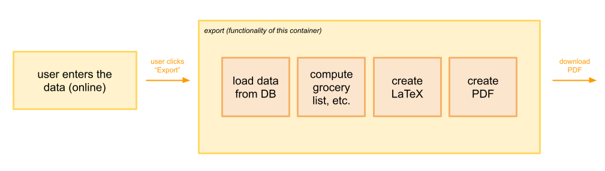

# Docker Container for Exporting a Camp

This Docker container contains the functionality for the PDF export of a camp.



## Setup

Before running the container, you must add your own keys files to the folder `./keys/`. Both key for
the `Firebase Admin SDK` and for the `Influxdb`. Latter should be a file of the following structure
called `./keys/influx_settings.json`

```json
{
  "host": ...,
  "port": ...,
  "username": ...,
  "password": ...,
  "database": ...
}
```

## Build and Run

We expect docker is already pre-installed. Within a linux environment you can run the following command to build and
execute the export function inside a container environment.

```shell
docker build . -t exportcamp && docker run exportcamp
```

### run the export function outside a container environment

We expect you to have python and texlive installed on your system. Furthermore, you must install all the dependencies
listed in `requirements.txt`. Now, you can run the export function using the following command. Replace `{{user_id}}`
and `{{ucamp_id}}` with the corresponding document ids. A full list of the optional arguments can be found
in [this collection](script/README.md).

```shell
python script/pdf_generator.py {{user_id}} {{camp_id}} --optionalArgs
```

For example:

```shell
python script/pdf_generator.py CKsbjuHkJQUstW1YULeAepDe9Wl1 16fXu6siwVDX1OOb38P3 --dfn --lscp --mp
```

## Testing

Exporting the camp at the end of its creation process is one of the application's core features. Therefore, extensive
testing is desired and necessary. See [test strategy](tests/README.md) for details. The tests can be run outside a
container environment with the following command:

```shell
python tests/test.py
```