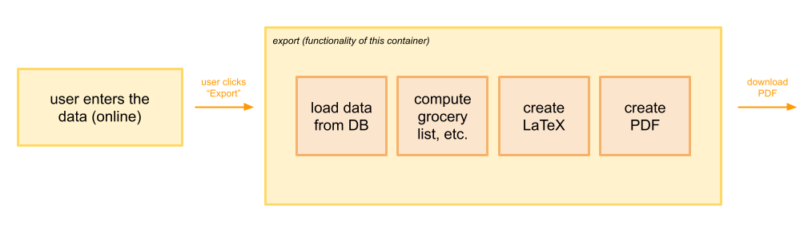

# Docker Container for Exporting a CampClass

This Docker container contains the functionality for the PDF export of a camp.



This docker container hosts a simple flask server that exposes an API-endpoint to create PDF exports for a specific
camp. The endpoint accepts various export settings as HTTP queries directly in the URL. Each request to the
corresponding URL will trigger the creation of a PDF export. Once the PDF is created, the container will upload it to a
firebase-storage bucket. Furthermore, a new document is made in the Firestore database containing the export meta-data
and a link to the created PDF. This link will be used by the frontend to display a download link.

## Setup

Before running the container, you must add your own keys files to the folder `./keys/`. Both key for
the `Firebase Admin SDK` (inside a subfolder called ```firebase```) and for the `Influxdb`. Latter should be a file of
the following structure called `./keys/influx/influx_settings.json`.

```json
{
  "host": ...,
  "port": ...,
  "username": ...,
  "password": ...,
  "database": ...
}
```

## Build and Run

We expect docker is already pre-installed. Within a linux environment you can run the following command to build and
execute the export function inside a container environment.

```shell
docker build . -t exportcamp && docker run -e PORT=5000 -p 5000:5000 exportcamp
```

Now the webserver should run, and you can trigger a PDF creation by navigating to

```
http://localhost:5000/export/camp/<campID>/user/<userID>/?<optional_args>
```

For example
```http://localhost:5000/export/camp/16fXu6siwVDX1OOb38P3/user/CKsbjuHkJQUstW1YULeAepDe9Wl1/?--spl&--lscp&--wv```
will create an export for camp ```16fXu6siwVDX1OOb38P3``` including the shopping list and the weekview in landscape.

More export flags can be found [hier](./script/README.md).

### Run the export function outside a container environment

We expect you to have python and texlive installed on your system. Furthermore, you must install all the dependencies
listed in `requirements.txt`. Now, you can run the export function using the following command. Replace `{{user_id}}`
and `{{ucamp_id}}` with the corresponding document ids. A full list of the optional arguments can be found
in [this collection](script/README.md).

```shell
python pdf_generator.py {{user_id}} {{camp_id}} --optionalArgs
```

For example:

```shell
python pdf_generator.py CKsbjuHkJQUstW1YULeAepDe9Wl1 16fXu6siwVDX1OOb38P3 --dfn --lscp --mp
```

### Text written by the users

The names, descriptions and notes in the database and the arguments of a request are written by the users. They must
be printed as plain text and never be interpreted as LaTeX, as LaTeX commands can read the files of the container
(e.g. the key of the service account). Therefore:

- Pass every such value through `tex()` of `script/utils/latex.py` before you combine it with LaTeX code in a
  `NoEscape` string. Values that are handed to pylatex as plain strings (e.g. the cells of `add_row`) are escaped
  by pylatex.
- New arguments of the export are added to `script/utils/export_args.py`, which validates them.
- `pdflatex` is started by `run_pdflatex()`: without shell escape and without access to files outside of the
  directory of the document.

The tests in `tests/test_input_sanitising.py` cover the escaping and the validation, they need no database.

### LaTeX packages inside the container

To keep the image small, the container only includes the LaTeX packages the export uses. If the export needs a new
LaTeX package, add it to the `tlmgr install` command of the `Dockerfile` and load it in `docker/smoke_test.tex`.
The build compiles this document and fails if a package is missing.

## Testing

Exporting the camp at the end of its creation process is one of the application's core features. Therefore, extensive
testing is desired and necessary. See [test strategy](tests/README.md) for details. The tests can be run outside a
container environment with the following command:

```shell
python tests/test.py
```