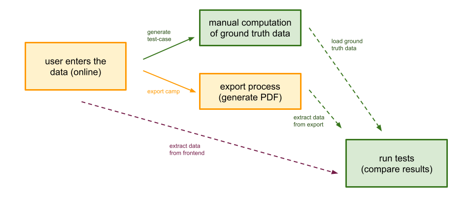

# Some General Thoughts

Exporting the camp at the end of its creation process is one of the application's core features. Therefore, extensive
testing is desired and necessary. These tests aim to check the data processing of the export function for correctness
and completeness.

The following schema should provide a general overview of our test strategy. In orange, we see the standard user
procedure of creating and exporting a camp as a PDF. And in Green, our current test pipeline. To simplify the assembling
of new test cases, we provide a script that generates templates for test cases directly out of the database (see
section *Generating Test Cases*). We can use these test cases to compare the results of the export function with the
hard-coded ground truth values manually calculated for those tests.



***Not yet included:** Furthermore, in purple, we compare the results of the export function and its associated ground
truth values with those on the web interface. E.g., we compare the calculated measure of an ingredient on the webpage
with the measurement in the exported recipe. This is especially exciting and important if participants are overwritten
for specific meals or recipes.*

You can run the test cases by executing the following command:

```shell
python tests/test.py 
```

## Generating Test-Cases

The test cases can be generated directly from the database using a script (see command below). The script generates a
JSON file that contains the mock data set for a selected camp we want to test the export for. The developer manually
adds the ground truth values, e.g., the purchase list, quantity calculations, etc.

Replace `{{user_id}}` and `{{ucamp_id}}` with the corresponding document ids.

```shell
python tests/create_test_case.py {{user_id}} {{camp_id}}
```

### An Example Test Case: The JSON Structure

```json
{
  "meals": [{
    ...,
    "recipes": [{
      ...,
      "ingredients": [...]
    }, ...]
  }, ...],
  "camp_meta_info": ...,
  "shopping_list": ...
}
```

