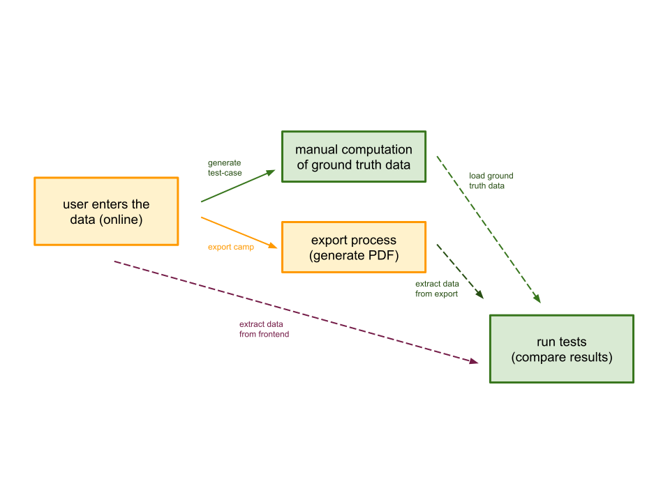

# Some General Thoughts About the Test-Cases

Exporting the recipes from the online platform is one of the core features of the application. Therefore, extensive
testing is desired and necessary. The tests are intended to check the data processing of the export function for
correctness and completeness. Different test-cases are needed to test these properties.

## Generating Test-Cases

The test cases can be generated directly from the database using a script (see command below), i.e. the data is recorded
in the frontend (as if a user is using the application), the script then generates a JSON-file that contains the mock
data for the test. The developer now manually adds the data to be calculated, such as the purchase list, quantity
calculations, etc.

    TODO: Add command for generating test-cases

