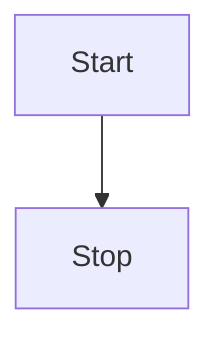

# About this Documentation

We build this documentation using [VitePress](https://vitepress.vuejs.org/), a modern static website generator based
on [Vue.js](https://vuejs.org/).

## Writing Content

The documentation is written in Markdown. You can find a good introduction to Markdown in the
[Markdown Guide](https://www.markdownguide.org/).

We have configured VitePress to support [Mermaid](https://mermaid-js.github.io/mermaid/#/), a markdown-based diagram    
generator. You can use it to create diagrams like this one:

directly in your Markdown files.

