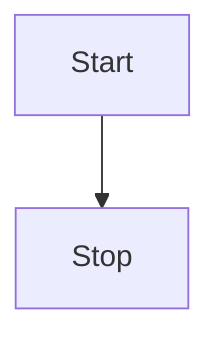

# About this Documentation

We build this documentation using [VitePress](https://vitepress.vuejs.org/), a modern static website generator based
on [Vue.js](https://vuejs.org/).

## Writing Guideline

We use the following conventions when writing documentation:

::: tip Highlight Useful Information

We use the tip block to highlight useful information (e.g. tips, side marks) for the user.

:::

::: warning Open Issues and TO-DO's, Known Bugs

We use the warning block to highlight open issues, known bugs, and other things that might be important for the user.
This box is also used to mark incomplete sections of the documentation.

:::

::: danger Critical Information

We use the danger block to highlight critical information (e.g. security warnings) for the user.

:::

::: details Additional Information

To provide additional information, which might be useful to some but not all users, we use the details block.

:::

## Writing Content

The documentation is written in Markdown. You can find a good introduction to Markdown in the
[Markdown Guide](https://www.markdownguide.org/).

We have configured VitePress to support [Mermaid](https://mermaid-js.github.io/mermaid/#/), a markdown-based diagram  
generator. You can use it to create diagrams like this one:

directly in your Markdown files.

